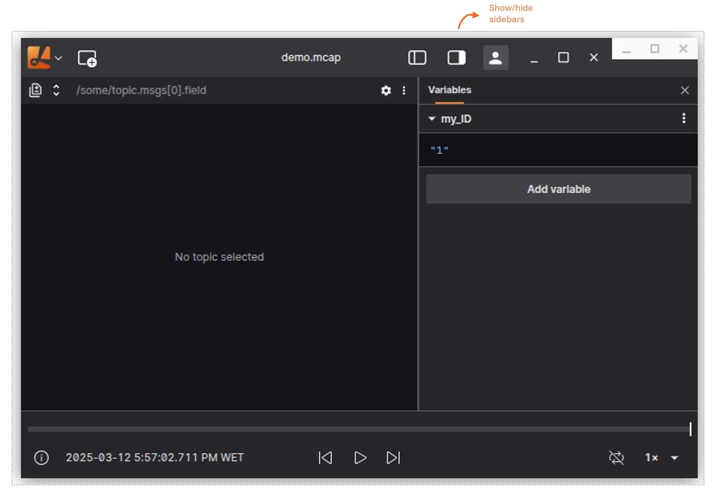

# Variables

Variables in Lichtblick allow users to define global values that can be reused across multiple panels within a layout. This feature simplifies updates and ensures consistency throughout your workspace. Variables can store primitive data types such as strings, numbers, or booleans. They can also be structured as arrays (e.g., `["x", 2, false]`) or maps (e.g., `{ "x": 2, "y": false }`).

To manage variables, access the **Variables** tab in the sidebar, where you can view, add, and modify them.

---

## Using Variables

Variables are referenced using the `$` prefix. For example, a variable named `my_global_var` is accessed as `$my_global_var`.

### In Message Paths

Panels that support message path syntax—such as **Raw Messages**, **Plot**, and **State Transitions**—can leverage variables to dynamically filter or slice data. This enables flexible and interactive data visualization.

#### Example Workflow:
1. Create a variable named `my_ID` in the **Variables** tab and set its value to `101`.
2. In a **Raw Messages** panel, use the path `/my_objects.objects[:]{id==$my_ID}` to inspect the object with `id == 101`.
3. In a **Plot** panel, add `/my_objects.objects[:]{id==$my_ID}.velocity` as the y-axis value to plot the velocity of the selected object.

### In User Scripts

User scripts can reference variables but cannot modify them. When a script is executed, it receives all variables as an object, allowing for dynamic data processing.

### Accessing and Modifying Variables in Extensions

Custom extension panels can interact with variables in two ways:

1. **Accessing Variables**:  
   Extensions can access variables using the **extension API RenderState**. This allows panels to seamlessly integrate with user-defined values, enabling dynamic and context-aware visualizations.

2. **Modifying Variables**:  
   Extensions can also create and modify variables programmatically using the **extension API PanelExtensionContext**. This capability is useful for updating variables based on user interactions or data processing within the extension.

For example, a custom panel could update a variable to reflect the current state of a simulation or user input, ensuring that the layout remains responsive and interactive.

---

## Updating Variables

Variables can be updated in two ways:

1. **Manually**: Edit variable values directly in the **Variables** tab.
2. **Dynamically**: Use interactive elements in the **3D panel** or **Variable Slider panel** to adjust variable values in real time.

---

## Keyboard Shortcuts

- Press `]` to toggle the visibility of the right sidebar.
- Use **input** + `↑` to increment numeric variable values.
- Use **input** + `↓` to decrement numeric variable values.

---

By utilizing variables, you can create dynamic and interactive layouts in Lichtblick, streamlining your workflow and enhancing data analysis capabilities.