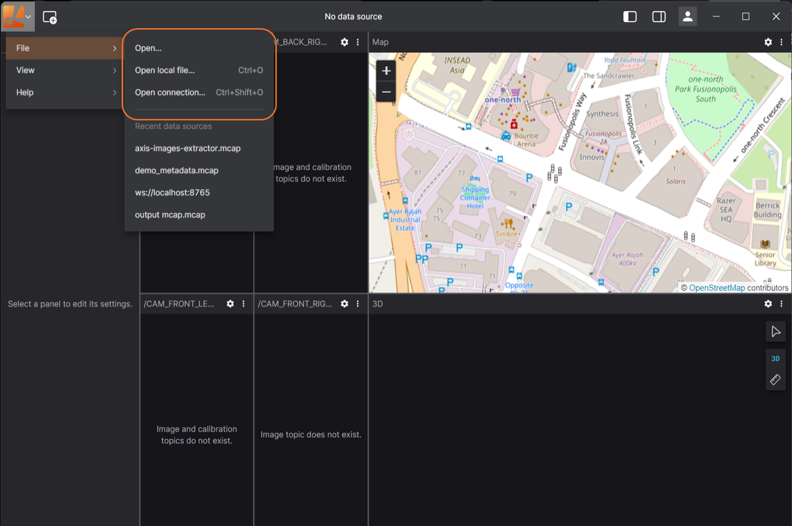
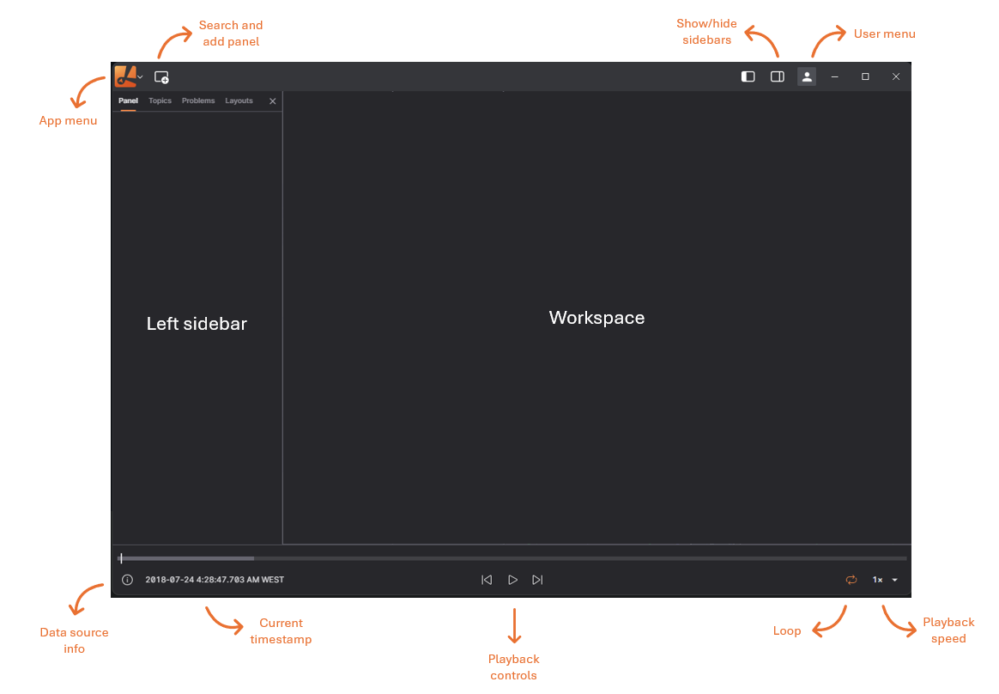
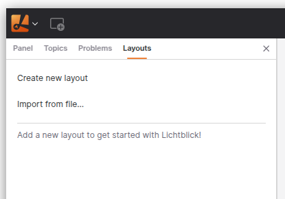
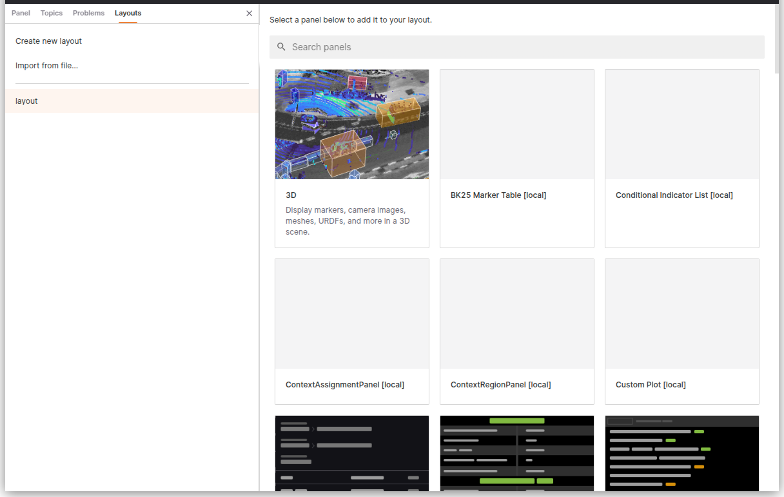
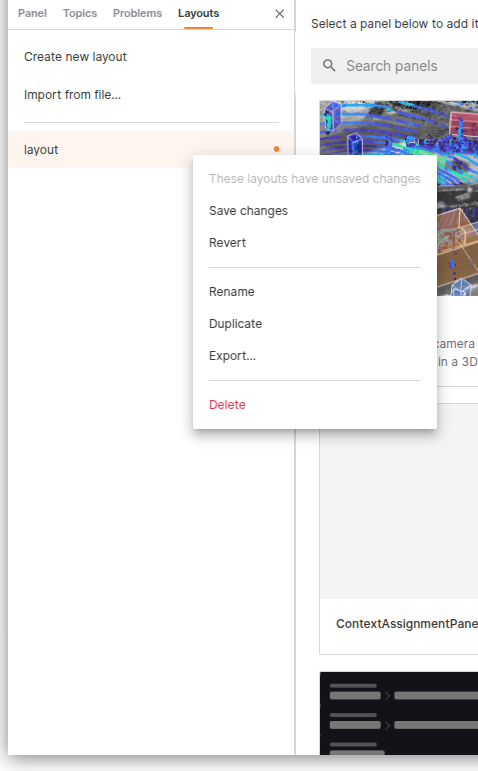
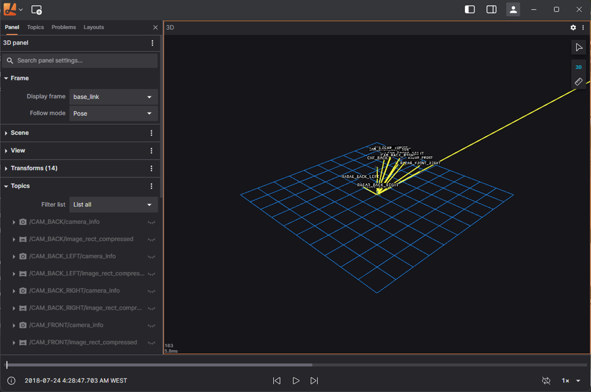
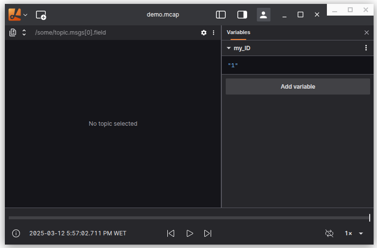

# Introduction

Lichtblick offers a comprehensive suite of visualization tools to help you analyze and interpret your robotics data effectively.

## Getting Started

To begin visualizing your data, connect to a data source and open a panel.

#### Open Data Source:
* Click "Open data source" in the left-hand menu.
* Choose from available options: live data or local file.



#### Opening a Panel:
* Click "Add panel" in the dashboard or left-hand menu.
* Select the desired panel type (e.g., 3D, Raw Message, Image).


## Desktop-only features

Connecting to data
* open a native ROS 1 connection
* connect to a Velodyne LIDAR hardware
* load local URDF and mesh resources in your 3D panel using package:// prefixed in the URLs

Extensions
* Install via registry
* Install locally 

## Interface Overview

Lichtblick's interface is designed for intuitive navigation:



**App Menu**: Connect to a data source, toggle sidebars, or access resources.<br>
**Users Menu**: Go to app settings, extensions catalog, experimental features, licenses, and version <br>
**Add Panel**: Add a new panel to your current layout.<br>
**Layout Menu**: Save your workspace view as a layout and share it with teammates.<br>
**Left Sidebar**: Edit panel settings, view data source topics, and troubleshoot connection issues.<br>
**Right Sidebar**: Set layout-wide variables, view playback metrics.<br>

## Sidebars

#### Panel sidebar
Edit settings for any selected panel

#### Topics sidebar
View all topics available in the data source, along with their data types and message rates

#### Problems sidebar
See a list of playback errors to troubleshoot

#### Variables sidebar
set layout-wide variables that can be used in different panels with the message path syntax

## System Requirements

Lichtblick supports Windows, macOS, and Linux on both web and desktop platforms.

For the web application, use Chrome v111 or later.

For the desktop application, download the latest version for your operating system - check our latest release.

# Playback

Lichtblick enables seamless navigation through both local and remote datasets using its playback controls.


## Message Sequencing

Messages within Lichtblick are arranged and played in order of their log timestamps. The log timestamp typically represents the moment a message was captured but can be adjusted to reflect the most relevant time context for your analysis. Selecting an appropriate timestamp is crucial, as external factors such as network delays, buffering, or batch processing can introduce time discrepancies.

In robotics, messages often carry multiple timestamps beyond the log time. Lichtblick’s Plot and State Transitions panels allow users to organize data using alternative timestamps:

| Timestamp       | Source                  | Description |
|----------------|-------------------------|-------------|
| Header Stamp   | ROS 1, ROS 2, custom messages | The `header.stamp` field contains separate `sec` and `nsec` values representing the recorded time. |
| Publish Time   | MCAP                     | A specialized MCAP field that optionally records the time a message was published. |

## Message Handling and Optimization

Lichtblick is designed to efficiently manage large-scale robotics data, ensuring smooth navigation and playback.

### Retrospective Message Fetching

When seeking a specific point in the data stream, it is unlikely that every subscribed topic has a message at the exact timestamp selected. To maintain data consistency across panels, Lichtblick implements a retrospective search for the most recent message on each topic. This ensures that when navigating to arbitrary time points, all active panels retain relevant and contextually accurate data.

### Persistent Data for Latched Topics

By default, Lichtblick retains the latest received messages for all topics when handling ROS 1 `.bag` files, MCAP files, or direct Lichtblick data streams. When navigating through time, Lichtblick retrieves and displays the most recent messages from all topics, even if they were recorded minutes before the selected timestamp. This feature allows panels to visualize infrequently published data reliably, ensuring continuity even when reviewing sparse datasets.

### Data Preloading for Enhanced Visualization

Certain Lichtblick panels, such as the Plot and Map panels, benefit from accessing data spanning the entire recording duration. Preloading enables these panels to analyze complete historical trends, detect anomalies, and observe long-term behavioral patterns in robotic systems.

Even panels that primarily display the latest data, such as the 3D panel, take advantage of preloaded data for precise rendering. For example, the 3D visualization panel preloads transformation messages to correctly position objects in a unified coordinate frame. In robotics, multiple reference frames (e.g., robotic arm joints, autonomous vehicle sensors) must be aligned for accurate visualization. Preloading ensures that Lichtblick has access to all necessary transform data, preventing inconsistencies in rendering dynamic robotic systems.

## Shortcuts

`Space` - pause or play<br>
`shift` + ⬅️ - seek backward 10ms <br>
`shift` + ➡️ - seek forward 10 ms <br>
⬅️ - seek backward 100ms <br>
➡️ - seek forward 100ms <br>
`Alt` + ⬅️ - seek backward 500ms <br>
`Alt` + ➡️ - seek forward 500ms

# Message Schemas

Lichtblick relies on structured message formats to ensure accurate data visualization and processing. By adhering to Lichtblick's schema standards, users can leverage the platform's robust visualization tools effectively.

## Supported Schema Formats
Lichtblick supports a variety of message formats, enabling seamless integration with diverse data sources. The supported formats include:

- Protobuf
- JSON Schema
- ROS 1
- ROS 2
- TypeScript
- FlatBuffers

If your existing message formats differ from these, Lichtblick provides tools to convert them into compatible schemas using a message conversion extension.

### Working with Protobuf and JSON Schema

To use Protobuf or JSON Schema with Lichtblick, follow these steps:

1. **Protobuf**: Include the necessary `.proto` files in your project. These files can be used to publish data via a WebSocket connection or log data into an MCAP file.
2. **JSON Schema**: Similarly, copy the required `.json` schema files into your project.

**Note on Protobuf Time Formats**: When using `google.protobuf.Timestamp` or `google.protobuf.Duration`, Lichtblick represents time values with `sec` and `nsec` fields (instead of `seconds` and `nanos`). This ensures consistency across time and duration formats in user scripts, message converters, and other platform components.

For JSON Schema integration, you can import schemas directly using the `@lichtblick/schemas` npm package:

```typescript
import { CompressedImage } from "@lichtblick/schemas/jsonschema";
```

Lichtblick also offers WebSocket libraries for real-time data handling in Python, JavaScript, and C++, as well as MCAP writers for logging pre-recorded datasets. For a practical example, refer to our blog post on **Recording Robotic Data with MCAP**, which demonstrates how to use the MCAP C++ writer to log Protobuf data.

### Schemaless JSON Support

Lichtblick supports schemaless JSON messages through MCAP. To send JSON data without a schema:

1. Set the channel's message encoding to `json`.
2. Assign the schema ID as `0` to indicate no associated schema.

For more details, consult the [MCAP Specification on Channels](https://mcap.dev/spec#channel-op0x04).


## ROS Integration

Lichtblick provides dedicated ROS message packages for both ROS 1 and ROS 2. To integrate:

1. Install the appropriate package for your ROS version:
```sh
sudo apt install ros-noetic-lichtblick-msgs # For ROS 1
```
```sh
sudo apt install ros-galactic-lichtblick-msgs # For ROS 2
```

2. Import the necessary schemas into your ROS project to begin publishing data:

```python
from lichtblick_msgs.msg import Vector2

...
msg = Vector2()
msg.x = 0.5
msg.y = 0.7
```

## TypeScript Integration

Lichtblick schemas can be imported as TypeScript types, enabling type-checking and message validation. Here’s how to use them:

1. **In User Scripts**: Specify the schema using `Message<"lichtblick.[SchemaName]">` in the User Scripts panel:

```typescript
import { Input, Message } from "./types";

type Output = Message<"lichtblick.Point2">;

export const inputs = ["/input/topic"];
export const output = "/studio_script/output_topic";

export default function script(event: Input<"/input/topic">): Output {
  return { x: 1, y: 2 };
}
```

2. **In TypeScript Projects**: Import types directly from the `@lichtblick/schemas` npm package:

```typescript
import { Point2 } from "@lichtblick/schemas";

const myImage: Point2 = { x: 1, y: 2 };
```

These types are compatible with JavaScript WebSocket or MCAP projects and can be used when writing custom data transformation scripts within Lichtblick's User Scripts panel.


# Custom Layouts in Lichtblick

Lichtblick layouts enable users to design and save customized workspaces tailored to specific tasks or workflows. These layouts can be reused for recurring projects or shared with team members working on similar challenges.

## Use Cases for Layouts

Layouts are highly versatile and can be adapted to various engineering and development scenarios. For instance:

- **Perception Engineers**: Create layouts for sensor calibration tasks.
- **Planning Engineers**: Design layouts to visualize and analyze routing algorithm outputs.
- **Controls Engineers**: Configure layouts to monitor and debug robot kinematics.

The **Layouts** menu provides all the tools needed to create, modify, and share layouts, ensuring a streamlined workflow.



## Layouts Menu Overview

### Personal Layouts

Personal layouts are exclusive to your account and cannot be accessed or modified by others. When signed in, these layouts are synchronized across all your devices, ensuring consistency. Additionally, personal layouts can be shared with your organization if required.

---

### Creating a Layout

To create a new custom workspace:

1. Navigate to the **Layouts** menu.
2. Select **Create new layout**.



#### Customization Options:
- **Add and arrange panels**: Organize panels to suit your workflow.
- **Adjust panel settings**: Configure individual panel properties.
- **Configure playback settings**: Tailor playback behavior for your data.
- **Set and manage variable values**: Define and control variables within the layout.

---

### Editing Layouts

When switching layouts after making changes to your current workspace, you will be prompted with the following options:

- **Save changes**: Save your modifications to the layout.
- **Revert**: Discard changes and restore the last saved version.



---

### Importing and Exporting Layouts

#### Exporting a Layout
To export a layout as a JSON file:

1. Open the layout’s context menu.
2. Select **Export...**.

Alternatively, you can access this option through the **View** submenu in the app menu (**Export layout to file...**).

#### Importing a Layout
To import a previously exported layout:

1. Navigate to the **Layouts** menu.
2. Select **Import from file...**.

This option is also available in the **View** submenu in the app menu (**Import layout from file...**).

---

### Sharing Layouts

To share a personal layout with your organization:

1. Open the layout’s context menu.
2. Select **Share with team...**.

---

### Additional Layout Actions

Each layout includes a **Details** menu, which provides options to:

- **Rename**: Change the layout’s name.
- **Duplicate**: Create a copy of the layout.
- **Delete**: Remove the layout permanently.

#### Batch Actions
To perform actions on multiple layouts simultaneously:

- Use **Cmd** (Mac) or **Ctrl** (Windows/Linux) to select multiple individual layouts.
- Use **Shift** to select a contiguous range of layouts.
- Right-click any selected layout and use the context menu to apply batch actions.

---

By leveraging Lichtblick's layout features, you can create efficient, reusable workspaces tailored to your specific needs, enhancing productivity and collaboration.


# Panels

## Overview
Panels in Lichtblick are flexible, modular elements that allow you to visualize and interact with data. You can customize and organize these panels within your layout.
To add a panel, use the "Add Panel" menu to select a new panel, or drag and drop the panel directly into your layout. 


Once added, you can easily move panels around by dragging their top bar.

Each panel's top bar has quick access to:
* **Menu** (represented by 3 dots) for common actions like panel splitting or changing the panel type
* **Settings** accessed through the cog icon to adjust the panel's configuration

### Customizing Panels
To edit a panel, click on the cog icon on its top bar to open the settings in the left sidebar. Each pael will be highlighted with the orange border when selected.



The sidebar allows you to filter the topics from your data source, and you can drang and drop topic results into panels for quick visualization. 


Topics can be mapped to specific panel types like:
* Raw messages and table panel for detailed message views
* Image panel for visual topics
* Plot and State Transiton panel for mesage path with graph-related data.


For selecting multiple message paths, hold `shift` for a range, or `Ctrl` (or `Cmd` on macOS) for multiple non-adjacent items.


# Variables

Variables in Lichtblick allow users to define global values that can be reused across multiple panels within a layout. This feature simplifies updates and ensures consistency throughout your workspace. Variables can store primitive data types such as strings, numbers, or booleans. They can also be structured as arrays (e.g., `["x", 2, false]`) or maps (e.g., `{ "x": 2, "y": false }`).

To manage variables, access the **Variables** tab in the sidebar, where you can view, add, and modify them.



---

## Using Variables

Variables are referenced using the `$` prefix. For example, a variable named `my_global_var` is accessed as `$my_global_var`.

### In Message Paths

Panels that support message path syntax—such as **Raw Messages**, **Plot**, and **State Transitions**—can leverage variables to dynamically filter or slice data. This enables flexible and interactive data visualization.

#### Example Workflow:
1. Create a variable named `my_ID` in the **Variables** tab and set its value to `101`.
2. In a **Raw Messages** panel, use the path `/my_objects.objects[:]{id==$my_ID}` to inspect the object with `id == 101`.
3. In a **Plot** panel, add `/my_objects.objects[:]{id==$my_ID}.velocity` as the y-axis value to plot the velocity of the selected object.

### In User Scripts

User scripts can reference variables but cannot modify them. When a script is executed, it receives all variables as an object, allowing for dynamic data processing.

### In Lichtblick Extensions

Custom extension panels can access variables using the **extension API RenderState**, enabling seamless integration with user-defined values.

---

## Updating Variables

Variables can be updated in two ways:

1. **Manually**: Edit variable values directly in the **Variables** tab.
2. **Dynamically**: Use interactive elements in the **3D panel** or **Variable Slider panel** to adjust variable values in real time.

Additionally, Lichtblick extensions can create and modify variables programmatically using the **extension API PanelExtensionContext**.

---

## Keyboard Shortcuts

- Press `]` to toggle the visibility of the right sidebar.
- Use **input** + `↑` to increment numeric variable values.
- Use **input** + `↓` to decrement numeric variable values.

---

By utilizing variables, you can create dynamic and interactive layouts in Lichtblick, streamlining your workflow and enhancing data analysis capabilities.


# Message path syntax

# Extensions

# Shareable links


# Open via CLI


# Shortcuts


# Annotate ROS enum fields


